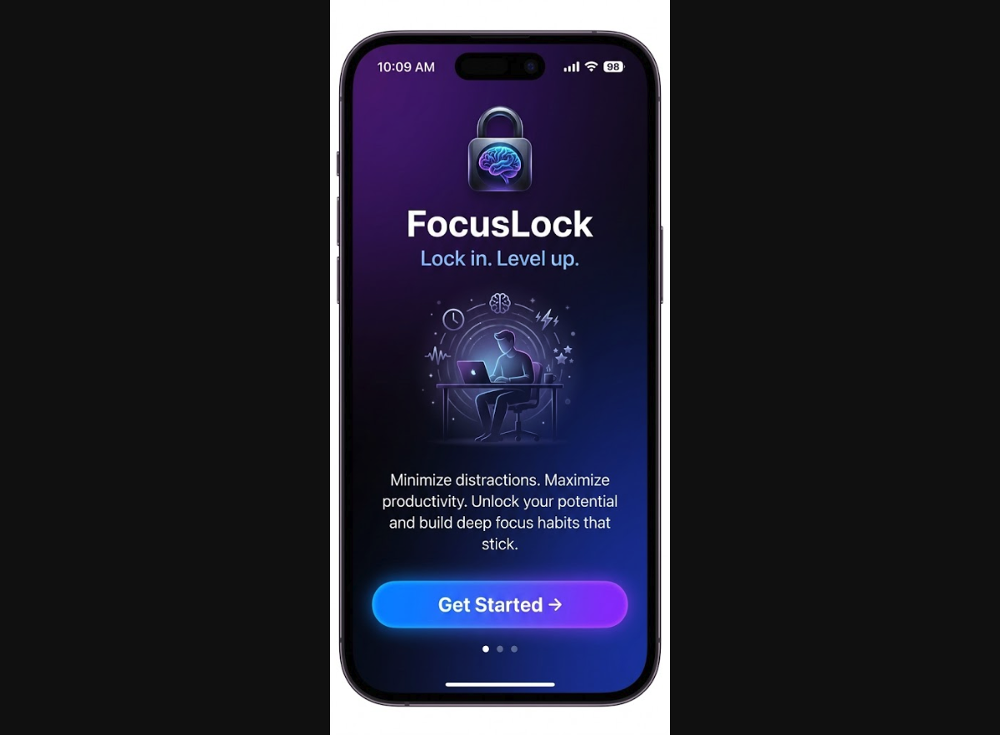
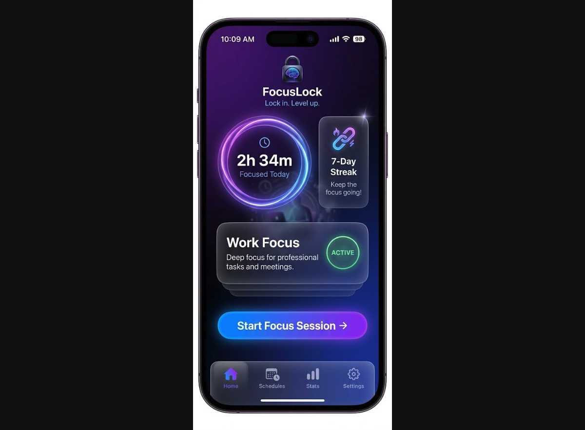
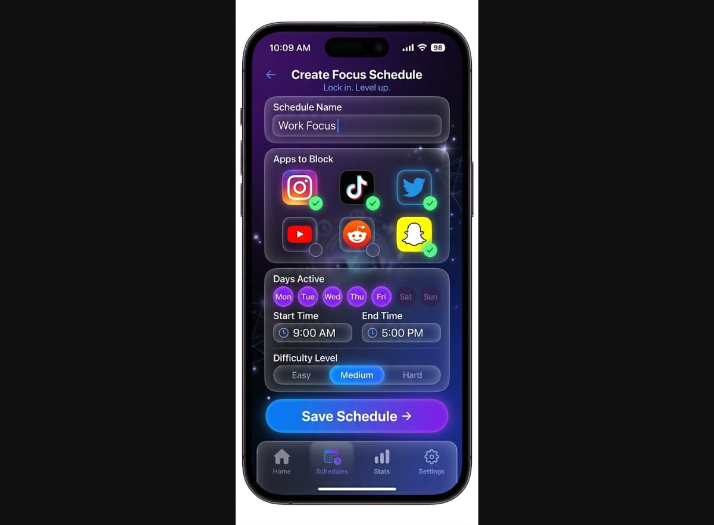
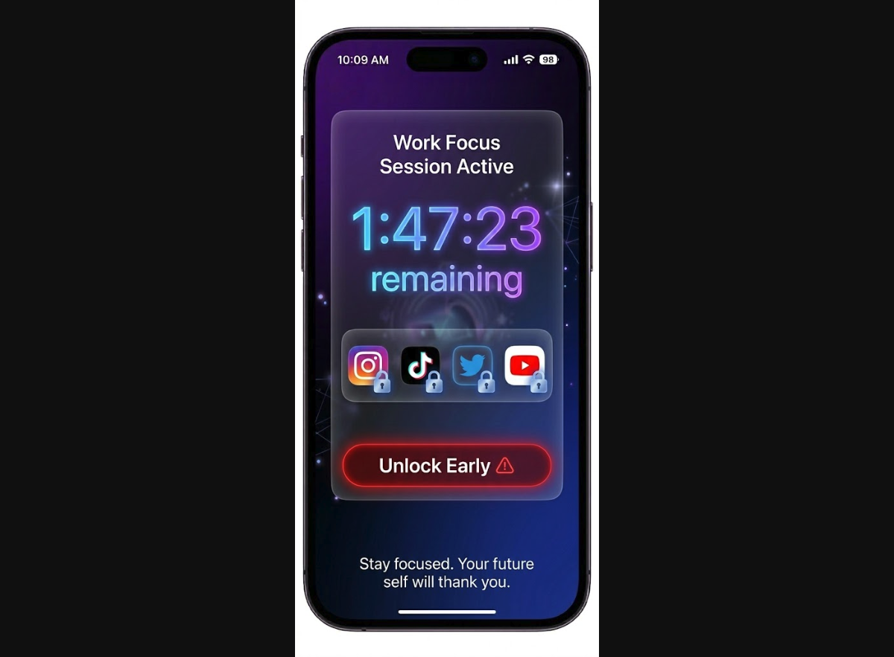
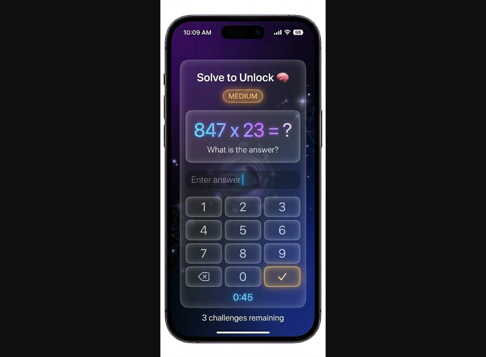
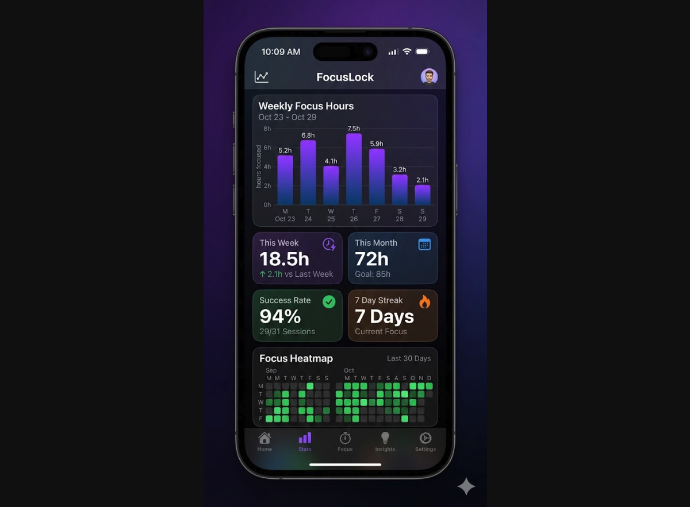
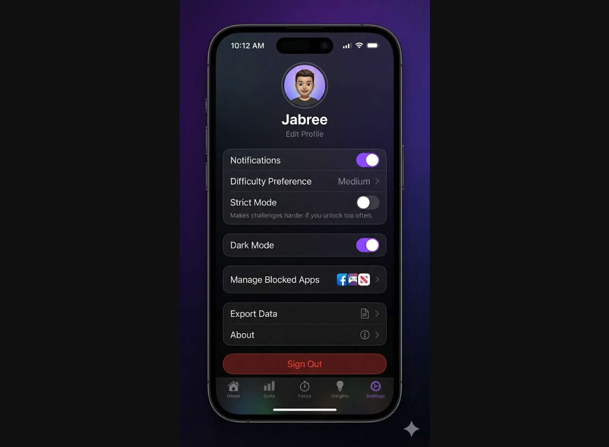

# 🔒 FocusLock

**Lock in. Level up.**

FocusLock helps you take control of your screen time by locking distracting apps on a schedule — and making you earn your way out with brain challenges. No more mindless scrolling.

## ✨ Features

- **Custom Schedules** — Set focus sessions by day, time, and duration
- **App Blocking** — Lock specific apps using the Screen Time API
- **Challenge Unlock** — Solve puzzles to unlock early (no easy outs)
- **Stats Dashboard** — Track your focus streaks, screen time saved, and progress
- **Onboarding Flow** — Quick setup to get blocking in minutes
- **Persistent Storage** — All data saved locally with SwiftData

## 📱 Screenshots

| | | |
|:---:|:---:|:---:|
|  |  |  |
| **Onboarding / Welcome** | **Home Dashboard** | **Schedule Creator** |
|  |  |  |
| **Active Lock Screen** | **Challenge / Puzzle** | **Stats Dashboard** |
|  | | |
| **Settings** | | |

## 🛠 Tech Stack

- **SwiftUI** — Declarative UI
- **iOS 17+** — Minimum deployment target
- **Screen Time API** — `FamilyControls` & `ManagedSettings` for app blocking
- **SwiftData** — Local persistence

## 🚀 Getting Started

1. **Clone the repo**
   ```bash
   git clone https://github.com/jabreeflor/focuslock-app.git
   ```
2. **Open in Xcode** — Requires Xcode 15+
3. **Set your team** — Signing & Capabilities → select your dev team
4. **Enable Screen Time entitlement** — Add `Family Controls` capability
5. **Build & Run** on a physical device (Screen Time API requires a real device)

## 📄 License

MIT
