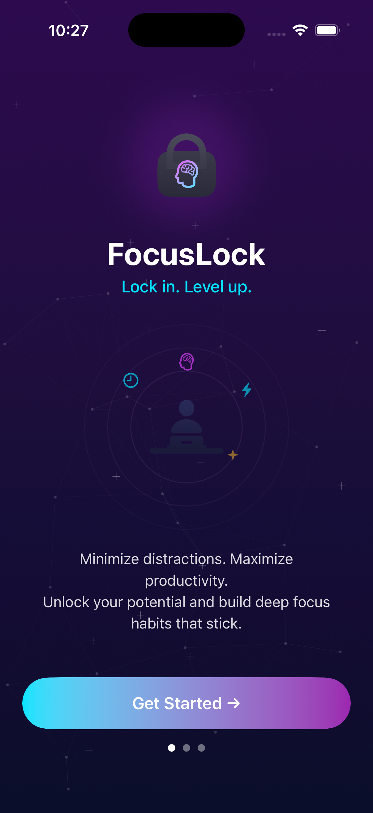

# 🔒 FocusLock

**Lock in. Level up.**

FocusLock is an iOS app that helps you minimize distractions and maximize productivity. Block distracting apps on a schedule, complete challenges to unlock early, and track your focus streaks over time. Build deep focus habits that stick.

---

## 📱 Screenshots

| Onboarding | Dashboard | Schedule Creator |
|:---:|:---:|:---:|
|  |  |  |

| Lock Screen | Challenge | Stats |
|:---:|:---:|:---:|
|  |  |  |

| Settings |
|:---:|
|  |

---

## 📲 Simulator Evidence

The app running on the iOS Simulator:

| First Launch | Onboarding Running | After Get Started |
|:---:|:---:|:---:|
|  |  |  |

---

## ✨ Features

- **Onboarding Flow** — Guided setup with Screen Time permission requests
- **Focus Schedules** — Create custom schedules with app selection, day/time pickers, and difficulty levels
- **App Blocking** — Block distracting apps (Instagram, TikTok, Twitter, YouTube, Reddit, Snapchat) using the Screen Time API
- **Active Lock Screen** — Countdown timer showing remaining focus time with locked app icons
- **Unlock Challenges** — Solve math problems to unlock early (Easy/Medium/Hard difficulty)
- **Strict Mode** — Increases challenge difficulty if you unlock too often
- **Stats Dashboard** — Weekly focus hours chart, monthly totals, success rate, streak tracking, and focus heatmap
- **Dark Mode** — Full dark mode support
- **Data Export** — Export your focus data

---

## 🛠 Tech Stack

- **SwiftUI** — Declarative UI framework
- **iOS 17+** — Minimum deployment target
- **SwiftData** — Persistence layer
- **Screen Time API (FamilyControls)** — App blocking via `ManagedSettings` and `DeviceActivity`

---

## 🧪 BDD Test Scenarios

Comprehensive Gherkin-format test scenarios covering all MVP features:

- Onboarding & permissions
- Schedule creation & management
- Focus session lifecycle
- Challenge system (Easy/Medium/Hard)
- Stats & streaks
- Settings & strict mode
- Edge cases & error handling

👉 [View full BDD scenarios](docs/BDD-Scenarios.md)

---

## 📁 Project Structure

```
FocusLock/
├── App/
│   ├── FocusLockApp.swift          # App entry point
│   └── ContentView.swift           # Root navigation
├── Features/
│   ├── Onboarding/
│   │   └── OnboardingView.swift    # Welcome & permission flow
│   ├── Home/
│   │   └── HomeView.swift          # Dashboard with streak & schedule cards
│   ├── Schedule/
│   │   ├── ScheduleCreatorView.swift  # Create/edit focus schedules
│   │   └── ScheduleListView.swift     # List saved schedules
│   ├── ActiveLock/
│   │   └── ActiveLockView.swift    # Active session countdown
│   ├── Challenge/
│   │   └── ChallengeView.swift     # Math challenges to unlock early
│   ├── Stats/
│   │   └── StatsView.swift         # Focus analytics & heatmap
│   └── Settings/
│       └── SettingsView.swift      # App preferences & profile
├── Models/
│   ├── FocusSchedule.swift         # Schedule data model
│   ├── FocusSession.swift          # Session tracking model
│   ├── Challenge.swift             # Challenge types
│   └── ChallengeAttempt.swift      # Challenge attempt tracking
├── Services/
│   ├── ChallengeEngine.swift       # Challenge generation & validation
│   └── ScreenTimeService.swift     # Screen Time API integration
└── Shared/
    ├── Components/
    │   ├── SharedComponents.swift  # Reusable UI components
    │   └── NetworkLinesView.swift  # Background animation
    └── Theme/
        └── Theme.swift             # Colors, gradients, styling
```

---

## 🚀 Getting Started

### Prerequisites

- Xcode 15+
- iOS 17+ device or simulator
- Apple Developer account (required for Screen Time API entitlements)

### Setup

1. Clone the repo:
   ```bash
   git clone https://github.com/jabreeflor/focuslock-app.git
   cd focuslock-app
   ```

2. Open in Xcode:
   ```bash
   open FocusLock.xcodeproj
   ```

3. Select your target device/simulator and run (⌘R)

> **Note:** Full app blocking functionality requires the Family Controls entitlement, which needs an Apple Developer account and device testing.

---

## 📄 Documentation

- [Product Requirements Document (PRD)](docs/PRD.md)
- [BDD Test Scenarios](docs/BDD-Scenarios.md)

---

## 📝 License

Private project by [@jabreeflor](https://github.com/jabreeflor).
